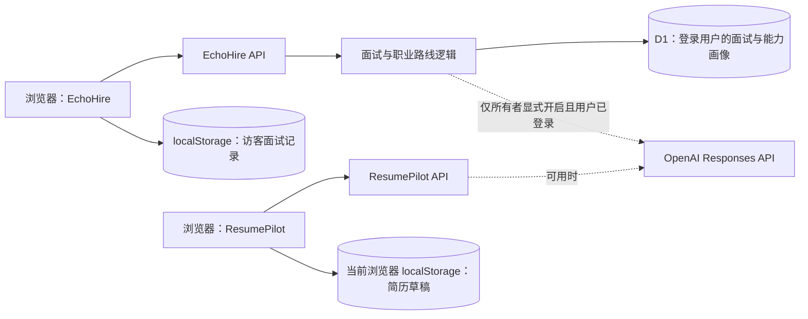

# EchoHire · 面试训练与职业路线

[在线站点](https://echohire-ai-interview.guolinghao6.chatgpt.site/) · [配套简历编辑器 ResumePilot](https://github.com/GUOGE667/resume-pilot)

EchoHire 让求职者围绕目标岗位和职位描述完成模拟面试、逐题追问、复盘与下一步训练规划。公开站点支持无需 ChatGPT 登录的访客模式：题目、追问和报告使用离线规则，记录只保存在访客当前浏览器。当前职业路线页根据已保存的面试与能力画像生成规则驱动的行动建议；它不是自主规划的 LLM Agent。

**离线追问与报告评测：**40 条独立虚构案例，默认备用规则的追问类型与预设标签一致 35/40（87.5%）；暴露了英文行动描述和“数字不等于证据”等边界。详见[评测协议、混淆矩阵与错误分析](docs/OFFLINE_EVAL.md)。该结果不代表真实面试质量或在线模型效果，运行时不消耗 API 额度。

**浏览器回归：**Playwright 使用虚构数据覆盖 mock 流程与无需登录的真实本地 API 流程，检查创建面试、逐题保存、刷新恢复与报告展示。测试关闭付费 API，不验证真实模型或云端 D1。

## 已实现

- 访客只需填写岗位与 JD，即可创建四题离线面试；无需上传简历或登录。
- 登录用户仍可导入 PDF 或 ResumePilot 文本；当前免费模式的题目只使用岗位与 JD，暂不解析简历内容。
- ResumePilot 跳转会带入简历正文和 JD，但免费模式不会根据简历正文定制题目；开始面试前页面会明确说明这一点。
- 按上一题内容决定是否追问，最多插入两题；OpenAI 不可用时按个人行动、结果、证据和技术取舍生成备用追问。
- 逐题报告、能力维度、训练建议；报告标明 `ai` 或 `fallback` 来源。
- 访客记录只存当前浏览器的 localStorage；登录用户通过 D1 保存面试、答题进度和能力画像。当前免费模式不读取 PDF 内容，也不将文件保存到 R2。
- 职业路线页与 ResumePilot 双向跳转；面试反馈可通过 URL 片段带回简历编辑器。

## 架构



两个站点之间使用用户主动点击的 URL 片段交接简历文本与面试反馈；**不共享数据库或登录身份**。详见 [阶段 4 评测与作品说明](docs/PORTFOLIO.md)。

## 本地运行与验证

要求 Node.js ≥ 22.13、pnpm 11。默认无需 API Key，也不会产生 OpenAI API 费用。若未来所有者决定为已登录用户启用付费模型，需要显式配置 `ECHOHIRE_ALLOW_PAID_API=true` 和自己的 `OPENAI_API_KEY`；访客始终使用离线规则。密钥不要提交。

```powershell
pnpm install
pnpm dev
pnpm test
pnpm eval:offline
pnpm test:e2e
pnpm lint
pnpm build
```

`pnpm test` 为离线确定性测试，不发起 OpenAI 请求。站点部署于 OpenAI Sites，机密只通过部署环境变量配置。
`pnpm test:e2e` 需要本机安装 Chrome；Playwright 会启动本地服务，一条用接口 mock，一条调用真实本地 API，都会阻止页面请求第三方域名。无需 API Key 或 Sites 登录。

## 边界

- 当前站点默认关闭付费模型请求；即使托管环境存在 API Key，也不会自动调用。访客始终使用离线规则，不能把规则追问和报告称为在线模型结果。
- 访客记录不跨浏览器或设备同步；清除网站数据后无法恢复。
- ResumePilot 草稿只在原浏览器保存，并非云端同步；EchoHire 的 D1 面试记录与此不同。
- 托管配置预留了 R2 绑定，但当前上传流程没有写入 R2；不要将其表述为已实现的文件持久化。
- 这是求职训练辅助工具，评分与建议不等于真实招聘判断。
- 浏览器回归目前覆盖一条核心流程，尚未覆盖真实 D1、跨设备同步、性能压测或真实用户效果评估。

## License

个人作品集与学习展示；复用请先联系作者。
