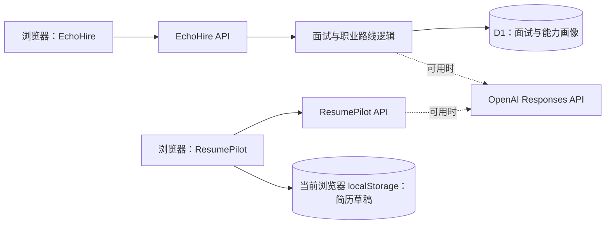

# EchoHire · 面试训练与职业路线

[在线站点](https://echohire-ai-interview.guolinghao6.chatgpt.site/) · [配套简历编辑器 ResumePilot](https://github.com/GUOGE667/resume-pilot)

EchoHire 让求职者从简历和岗位描述出发，完成模拟面试、逐题追问、复盘与下一步训练规划。当前职业路线页根据已保存的面试与能力画像生成规则驱动的行动建议；它不是自主规划的 LLM Agent。

**离线追问与报告评测：**40 条独立虚构案例，默认备用规则的追问类型与预设标签一致 35/40（87.5%）；暴露了英文行动描述和“数字不等于证据”等边界。详见[评测协议、混淆矩阵与错误分析](docs/OFFLINE_EVAL.md)。该结果不代表真实面试质量或在线模型效果，运行时不消耗 API 额度。

## 已实现

- PDF 简历或 ResumePilot 文本导入，结合岗位 JD 创建四题面试；OpenAI 不可用时使用备用题目。
- 按上一题内容决定是否追问，最多插入两题；OpenAI 不可用时按个人行动、结果、证据和技术取舍生成备用追问。
- 逐题报告、能力维度、训练建议；报告标明 `ai` 或 `fallback` 来源。
- 登录后通过 D1 保存面试、答题进度和能力画像；刷新后可恢复。上传 PDF 用于创建面试，本项目不将文件长期保存到 R2。
- 职业路线页与 ResumePilot 双向跳转；面试反馈可通过 URL 片段带回简历编辑器。

## 架构



两个站点之间使用用户主动点击的 URL 片段交接简历文本与面试反馈；**不共享数据库或登录身份**。详见 [阶段 4 评测与作品说明](docs/PORTFOLIO.md)。

## 本地运行与验证

要求 Node.js ≥ 22.13、pnpm 11。复制 `.env.example` 为 `.env.local`，按需填写自己的 OpenAI 密钥；密钥不要提交。

```powershell
pnpm install
pnpm dev
pnpm test
pnpm eval:offline
pnpm lint
pnpm build
```

`pnpm test` 为离线确定性测试，不发起 OpenAI 请求。站点部署于 OpenAI Sites，机密只通过部署环境变量配置。

## 边界

- OpenAI 调用取决于密钥与账户计费状态；不可用时自动降级。不能把备用追问和报告称为在线模型结果。
- ResumePilot 草稿只在原浏览器保存，并非云端同步；EchoHire 的 D1 面试记录与此不同。
- 托管配置预留了 R2 绑定，但当前上传流程没有写入 R2；不要将其表述为已实现的文件持久化。
- 这是求职训练辅助工具，评分与建议不等于真实招聘判断。
- 目前未完成完整的端到端浏览器回归、性能压测或真实用户效果评估。

## License

个人作品集与学习展示；复用请先联系作者。
